# Impact of COVID-19 on Global Stock Market Indices

## Purpose of the REPO

The repository holds the following files/ data
* 2 Jupyter Notebooks:
    * [Data cleanup and exploration](data_cleanup_exploration.ipynb): Data Sourcing, Clean up and exploration
    * [Market Data Analysis](market_data_analysis.ipynb): Data Analysis and Simulation Analysis
* CSV Data sets for all tickers/ indices
* Images used in the final deck and this MD file
* .gitignore file

## Motivation and Summary

This project is a summary of Covid-19 impact on the major global stock market indices

Questions to be answered:

* Was there any relevant impact on major global stock market indices?
* What was the difference in actual and forecasted prices due to Covid from mid february, 2020 till date?
* What are the changes in the future projected returns over 20 years?
* What is the Comparison of future projected returns over different time frames pre and post covid?

Summary of the findings:

* Shanghai Composite index was not as impacted as the other market indices. The recovery of Shanghai composite was much better than the other market indices.
* S&P 500 forecasted investment returns outcomes
    * Decrease in expected ROI over 20 years as a result of Covid-19
    * Lower variance in ROI over 20 years when considering dataset spread across 5 yrs vis-a-vis 12 months rolling data

* Global Stock market crashed at the outset of the Covid-19 pandemic, but  from the data, we noticed a slight recovery across most market indices
* The trend analysis suggests that Shanghai Composite index was not as impacted as the other market indices. Over the Covid-period, the forecasted market prices were between 10%-20% higher than actual market prices for S&P 500 and FTSE 100, but 2% lower for Shanghai composite. The recovery of Shanghai composite was much better than the other market indices.
* S&P 500 forecasted investment returns outcomes
  * Decrease in expected investment returns post the Covid-19 event in Feb/March 2020. 
  * Decrease in expected investment returns when comparing 1 year data to 5 years of data

## Data Extraction
* 14 Global market stock indices and commodities selected
* Closing market index price data: Google Finance and Yahoo Finance (through API and Pandas Data Reader)
* 5 Years daily closing data: Jan 1, 2015 - Jul 24, 2020

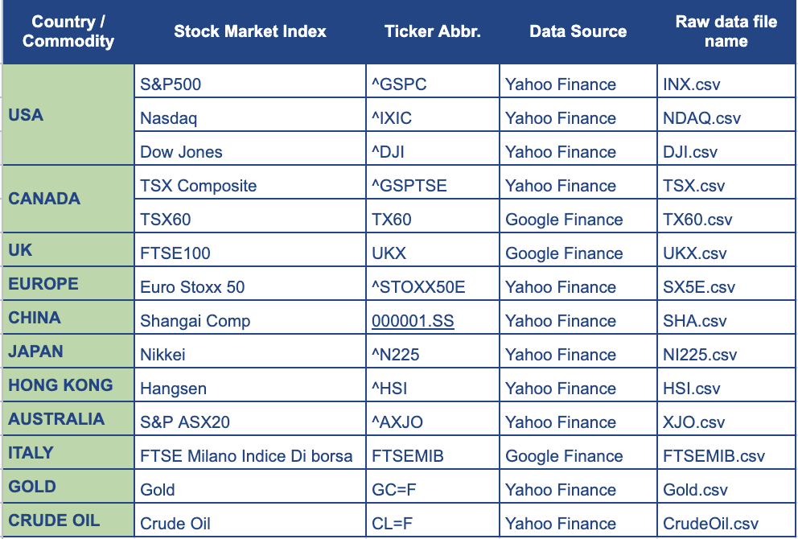

## Data Cleanup

Steps for data clean up:
* Imported csv files, sort & renaming
* Concatenate all tickers: consider data types and drop nulls
* Explore and divide data into Pre and Post Covid Data sets
* Imported csv files, sort & renaming
* Concatenate all tickers: consider data types and drop nulls
* Explore data and divide data into (pre- and post-covid) and 5 year (pre- and post-covid) datasets.

    * Pre-covid: up to 2020-02-14
    * Post-covid: up to 2020-07-24

Challenges:
* Finding 1 source of data for all ticker prices
* Time taken to extract and clean-up data was more than expected

## Data Exploration

Insights while exploring the data that was not anticipated
* Crude Oil daily returns was skewing the data and hence, we dropped the same from the analysis
* Limiting the number of Indices used for analysis

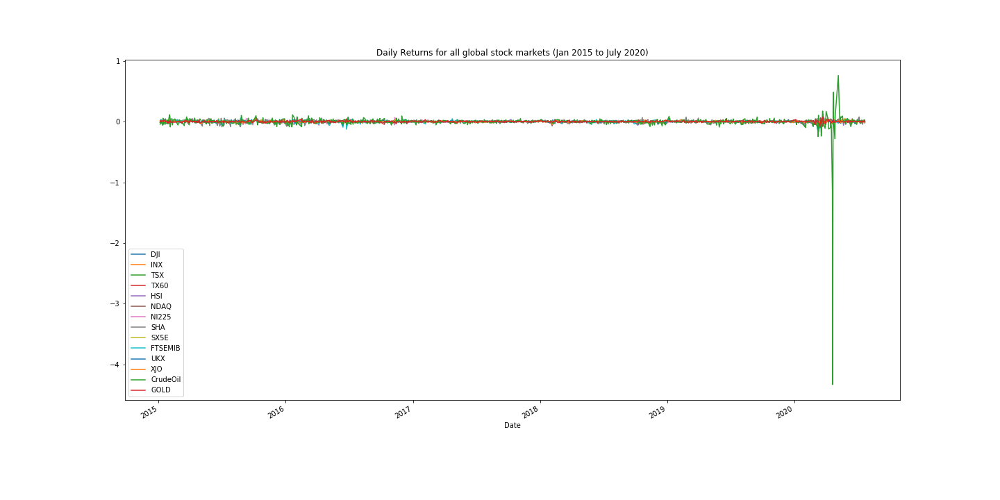
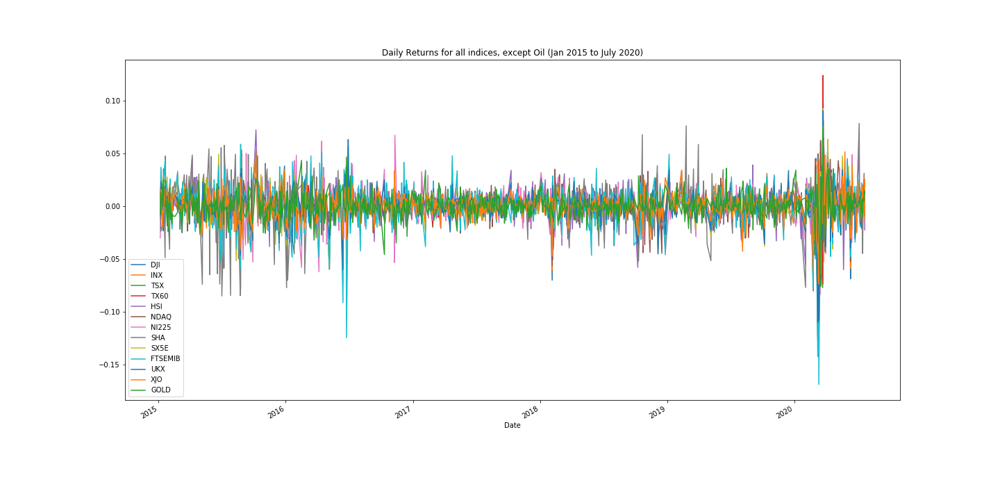
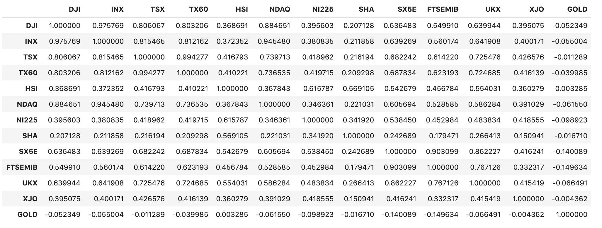
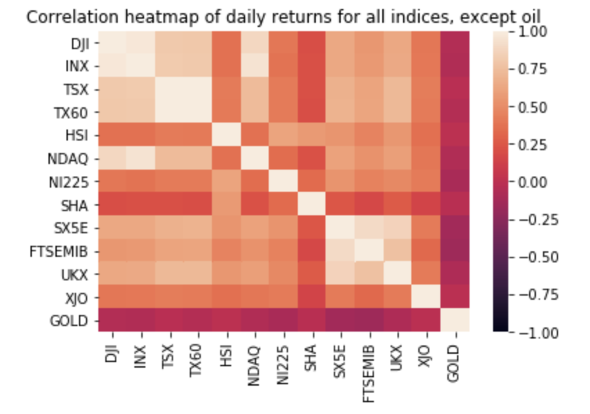

## Data Analysis

* 6 Stock market Indices: S&P 500, FTSE100, TSX, NI225, Shanghai, SX5E
* Daily and cumulative returns comparing pre- and post-covid periods for different datasets 
* Standard deviation and rolling standard deviation plots
* Comparison of actual market prices vs. forecasted market prices: S&P 500, Shanghai Composite, FTSE100 (period 15 Feb ‘20 to 24 Jul ‘20)
* Monte Carlo simulations (x 1000 over 20 years):
    * SP500 - return on investment for 1 year and 5 year datasets, for period pre- covid and post-covid

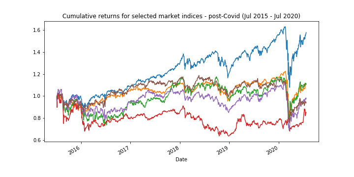

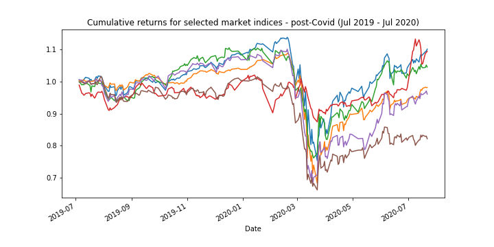

## Findings - Forecasted v Actual Price of 3 Indices
Actual vs Forecasted market index price (14 Feb - 24 July 2020) for S&P 500, Shanghai Composite Index and FTSE 100

* Forecast was based on historical 1 year price data up to 14 Feb 2020.
* Actual market price for both S&P 500 and FTSE 100 is less than forecasted price
* Actual market price for Shanghai composite is slightly higher than forecasted price

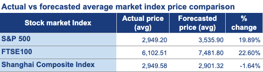

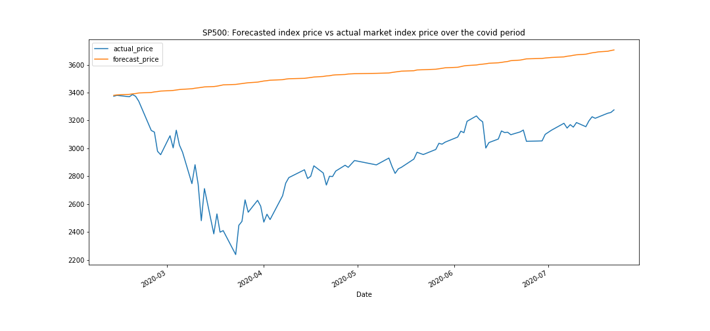

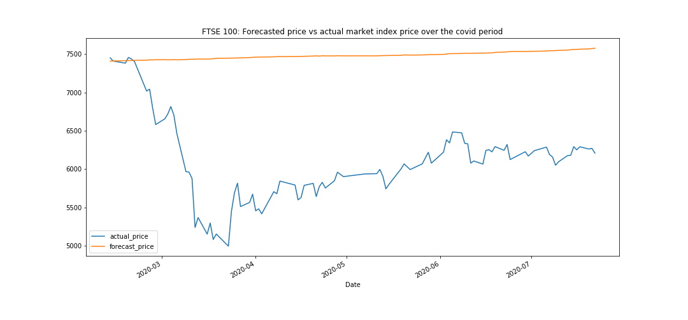

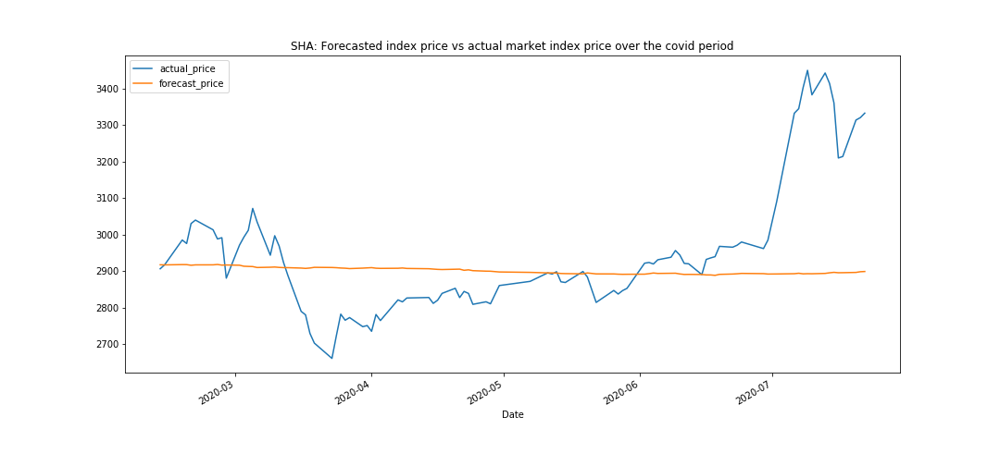

## Findings - S&P 500 Projected Returns over 20 years

* Decrease in investment return projections when comparing data pre- and post-covid
* 5 year dataset significantly lowers the variance as compared to 1 year rolling data

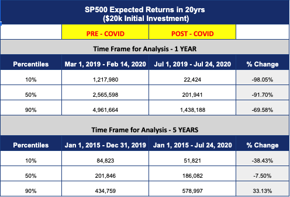

## Postmortem

Difficulties faced during analysis:
* Lack of time to run and analyse multiple simulations for different market indices
* Not much data for post covid period
* Challenge for the whole team to collaborate on a single project as first time programmers 

Questions discussed but remain unanswered:
* Analysis of forecast vs actual price for indices other than S & P 500, SHA & FTSE 100
* Enrich data with actual covid cases per country, creating a demographic comparison with the stock market index
* Monte Carlo Simulation for pre-covid and post-covid period for all the indices

If more time available, we would like to:
* Analyse other global stock market indices
* Apply more concepts learnt in class
* Simplified code through use of functions
* Spend more time researching the reasons for the outcome of the analysis, e.g market index news and economic policies, country specific covid policies 

### Project Team Members
* Amit Sharma
* Mihir Mehta
* Richa Dudani
* Zeldi Snyman

